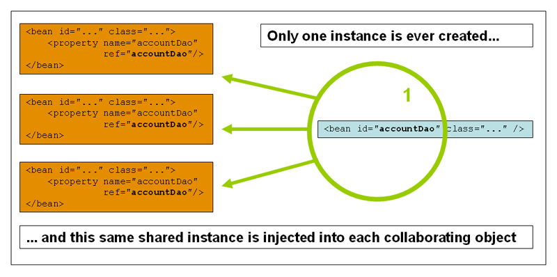

# Bean Scope (Bean的作用域)
当您创建一个bean定义时，您创建了一个初始化描述，用于创建由该bean定义的类的实际实例。bean定义是一个bean描述(definition)的想法很重要，因为这意味着，与使用类一样，您可以从一个描述中创建许多对象实例

您不仅可以控制要插入到从特定bean定义创建的对象中的各种依赖项和配置值，还可以控制从特定bean定义创建的对象的范围。这种方法功能强大且灵活，因为您可以通过配置选择创建的对象的作用域，而不必在Java类级别上设置对象的作用域。

可以将bean定义为部署在多个作用域中的一个。Spring框架支持6个作用域，其中__4个只有在使用web感知的ApplicationContext时才可用__。您还可以创建自定义作用域

下表描述了支持的作用域:
1. singleton （默认）将单个bean定义限定为每个Spring IoC容器的单个对象实例。
2. prototype  将单个bean定义限定为任意数量的对象实例。
3. request   将单个bean定义限定在单个HTTP请求的生命周期内。也就是说，每个HTTP请求都有自己的bean实例，该实例是在单个bean定义的后面创建的。只在具有web感知的Spring ApplicationContext上下文中有效。
4. session   将单个bean定义限定在HTTP会话的生命周期内。只在具有web感知的Spring ApplicationContext上下文中有效。
5. application  将单个bean定义限定在ServletContext的生命周期内。只在具有web感知的Spring ApplicationContext上下文中有效。
6. websocket    将单个bean定义限定在WebSocket的生命周期内。只在具有web感知的Spring ApplicationContext上下文中有效。

SimpleThreadScope是可用的，但默认情况下没有注册。有关更多信息，请参阅SimpleThreadScope的文档。有关如何注册此或任何其他自定义作用域的说明，请参阅使用自定义作用域。


# The Singleton Scope (单例)
只管理单例bean的一个共享实例，并且对具有一个或多个与该bean定义匹配的ID的bean的所有请求都会导致Spring容器返回一个特定的bean实例。

换句话说，当您定义一个bean定义并且它的作用域为单例时，Spring IoC容器只创建由该bean定义的对象的一个实例。
__这个单一实例存储在这种单例bean的缓存中，所有后续的请求和对该命名bean的引用都会返回缓存的对象__。
下图展示了单例作用域是如何工作的:

Spring的单例bean概念不同于(Gang of Four, GoF)模式书中定义的单例模式。 (就是私有构造器，dck的那种单例模式)
GoF单例对对象的作用域进行硬编码，使得每个ClassLoader只能创建一个特定类的实例。Spring单例的作用域最好描述为每个容器和每个bean。这意味着，如果您在单个Spring容器中为特定类定义一个bean，那么Spring容器将创建由该bean定义定义的类的一个且仅一个实例。
单例作用域是Spring的默认作用域。要将bean定义为XML中的单例，可以如下面的示例所示来定义bean

```xml
<bean id="accountService" class="com.something.DefaultAccountService"/>

<!-- the following is equivalent, though redundant (singleton scope is the default) -->
<bean id="accountService" class="com.something.DefaultAccountService" scope="singleton"/>
```


# The Prototype Scope (原型)

bean部署的非单例原型范围导致每次对特定bean发出请求时都创建一个新的bean实例。也就是说，将bean注入到另一个bean中，或者通过对容器的getBean()方法调用请求它。通常，应该对所有有状态bean使用原型作用域，对无状态bean使用单例作用域。下图说明了Spring原型范围:

数据访问对象(DAO)通常不配置为原型，因为典型的DAO不保持任何会话状态。对我们来说重用单例图的核心更容易。)

下面的示例将展示在XML中创建原型Bean:
```xml
<bean id="accountService" class="com.something.DefaultAccountService" scope="prototype"/>
```
与其他作用域相比，Spring并不管理原型bean的完整生命周期。容器实例化、配置和组装一个原型对象，并将其交给客户端，不再记录该原型实例。因此，尽管初始化生命周期回调方法会在所有对象上调用，而不考虑作用域。但在__原型的情况下，不会调用配置的销毁生命周期回调。__客户端代码必须清理原型作用域的对象，并释放原型bean持有的昂贵资源。要让Spring容器释放由原型作用域的bean持有的资源，请尝试使用一个自定义bean后处理器(bean post-processor )，该后处理器持有对需要清理的bean的引用。

在某些方面，Spring容器在原型作用域bean方面的作用是Java new操作符的替代品。此后的所有生命周期管理都必须由客户端处理。(有关Spring容器中bean生命周期的详细信息，请参见生命周期回调。)


# 带有原型bean依赖的单例bean

当您使用依赖于原型bean的单例作用域bean时，请注意依赖关系是在实例化时解析的。因此，如果您以依赖方式将一个原型作用域的bean注入到单例作用域的bean中，就会实例化一个新的原型bean，然后再将依赖方式注入到单例bean中。原型实例是提供给单例作用域bean的唯一实例。

但是，假设您希望单例作用域bean在运行时重复获取原型作用域bean的新实例。您不能依赖地将一个原型作用域的bean注入到单例bean中，因为这种注入只发生一次，即在Spring容器实例化单例bean并解析并注入它的依赖项时。

如果在运行时不止一次需要一个原型bean的新实例，请参见方法注入(Method Injection 就是上一节讲的那种，spring使用aop实现的)。


# Request, Session, Application, and WebSocket Scopes
request, session, application 和websocket 作用域只有当你使用一个web感知的Spring ApplicationContext实现(比如XmlWebApplicationContext)时才可用。如果您将这些作用域与常规的Spring IoC容器(例如ClassPathXmlApplicationContext)一起使用，则会抛出一个IllegalStateException，它会不知道未知的bean作用域。


# Web初始配置

为了在Request, Session, Application, and WebSocket 级别(web-scoped bean)上支持bean的作用域，在定义bean之前需要进行一些小的初始配置。(对于标准作用域:singleton和prototype，不需要初始设置。)

如何完成这个初始设置取决于您的特定Servlet环境。如果您在Spring Web MVC中访问作用域bean(实际上是在Spring DispatcherServlet处理的请求中)，则不需要进行特殊设置。DispatcherServlet已经公开了所有相关的状态。

如果您使用Servlet web容器，并且请求是在Spring的DispatcherServlet之外处理的(例如，当使用JSF时)，
则需要注册org.springframework.web.context.request.RequestContextListener ServletRequestListener。
这可以通过使用WebApplicationInitializer接口以编程方式完成。或者，将以下声明添加到web应用程序的web.xml文件中

```xml
<web-app>
	...
	<listener>
		<listener-class>
			org.springframework.web.context.request.RequestContextListener
		</listener-class>
	</listener>
	...
</web-app>
```

或者，如果侦听器设置有问题，可以考虑使用Spring的RequestContextFilter。
过滤器映射依赖于周围的web应用程序配置，因此您必须适当地更改它。下面的清单显示了一个web应用程序的过滤器部分:
```xml
<web-app>
	...
	<filter>
		<filter-name>requestContextFilter</filter-name>
		<filter-class>org.springframework.web.filter.RequestContextFilter</filter-class>
	</filter>
	<filter-mapping>
		<filter-name>requestContextFilter</filter-name>
		<url-pattern>/*</url-pattern>
	</filter-mapping>
	...
</web-app>
```

DispatcherServlet、RequestContextListener和RequestContextFilter都做完全相同的事情，即将HTTP请求对象绑定到为该请求提供服务的线程。这使得具有请求和会话作用域的bean在调用链的更下游可用。


# Request scope

考虑以下用于bean定义的XML配置:
```xml
<bean id="loginAction" class="com.something.LoginAction" scope="request"/>
```
Spring容器通过为每个HTTP请求使用LoginAction bean定义来创建LoginAction bean的新实例。也就是说，loginAction bean的作用域在HTTP请求级别。您可以随心所欲地更改创建的实例的内部状态，因为从相同loginAction bean定义创建的其他实例看不到这些状态更改。它们是特定于单个请求的。当请求完成处理时，将丢弃作用域为该请求的bean。

当使用注解驱动的组件或Java配置时，可以使用@RequestScope注解将组件分配给请求范围。下面的例子展示了如何这样做: 
```java
@RequestScope
@Component
public class LoginAction {
	// ...
}
```


# Session Scope

考虑以下用于bean定义的XML配置:
```xml
<bean id="userPreferences" class="com.something.UserPreferences" scope="session"/>
```
Spring容器通过在单个HTTP会话的生命周期中使用UserPreferences bean定义来创建UserPreferences bean的新实例。换句话说，userPreferences bean在HTTP会话级别有效地限定了作用域。与请求作用域的bean一样，您可以随心所欲地更改创建的实例的内部状态，要知道其他使用从相同userPreferences bean定义创建的实例的HTTP Session实例看不到这些状态变化，因为它们是特定于单个HTTP Session的。当HTTP会话最终被丢弃时，作用域为该特定HTTP会话的bean也被丢弃。

当使用注解驱动的组件或Java配置时，您可以使用@SessionScope注解将组件分配给会话范围。
```java
@SessionScope
@Component
public class UserPreferences {
	// ...
}
```


# Application Scope

考虑以下用于bean定义的XML配置:
```xml
<bean id="appPreferences" class="com.something.AppPreferences" scope="application"/>
```
Spring容器通过为整个web应用程序使用一次AppPreferences bean定义来创建AppPreferences bean的新实例。
也就是说，appPreferences bean的作用域在ServletContext级别，并作为常规ServletContext属性存储。这有点类似于Spring单例bean，但在两个重要方面有所不同:

- 它是每个ServletContext的单例，而不是每个Spring ApplicationContext(在任何给定的web应用程序中可能有几个)，并且它实际上是公开的，因此作为ServletContext属性可见。

当使用注解驱动的组件或Java配置时，您可以使用@ApplicationScope注解将组件分配给应用程序范围。下面的例子展示了如何这样做:
```java
@ApplicationScope
@Component
public class AppPreferences {
	// ...
}
```


# WebSocket范围

WebSocket作用域与WebSocket会话的生命周期相关联，并应用于基于WebSocket应用程序的STOMP，参见WebSocket作用域了解更多细节。


# Scoped Beans as Dependencies
Spring IoC容器不仅管理对象(bean)的实例化，还管理合作者(或依赖项)的连接。如果您想将(例如)一个HTTP请求作用域的bean注入到另一个存在时间较长的作用域的bean中，您可以选择注入AOP代理来代替作用域bean。
也就是说，__您需要注入一个代理对象，该对象公开与作用域对象相同的公共接口__，但也可以从相关作用域(如HTTP请求)检索实际目标对象，并将方法调用委托给实际对象。

您还可以在作用域为单例的bean之间使用<aop:scope -proxy/>，然后将引用通过一个可序列化的中间代理，从而能够在反序列化时重新获得目标单例bean。 当针对原型的bean声明<aop:scope -proxy/>时，共享代理上的每个方法调用都会导致创建一个新的目标实例，然后将调用转发到该实例。 此外，有作用域的代理并不是以生命周期安全的方式从较短的作用域访问bean的唯一方法。__您还可以将注入点(即构造函数或setter参数或autowired字段)声明为ObjectFactory<MyTargetBean>，从而允许getObject()调用在每次需要时按需检索当前实例，而无需保留实例或单独存储实例__。 

> [ObjectFactory的一篇博客](https://blog.csdn.net/qq_41907991/article/details/105123387)
> 作为扩展的变体，您可以声明ObjectProvider<MyTargetBean>，它提供了几个额外的访问变体，包括getIfAvailable和getIfUnique。 它的JSR-330变体称为Provider，并与每次检索尝试的Provider<MyTargetBean>声明和相应的get()调用一起使用。
> 有关JSR-330的更多详细信息，请参阅此处。

以下示例中的配置只有一行，但理解其背后的“为什么”和“如何”是很重要的:
```xml
<?xml version="1.0" encoding="UTF-8"?>
<beans xmlns="http://www.springframework.org/schema/beans"
	xmlns:xsi="http://www.w3.org/2001/XMLSchema-instance"
	xmlns:aop="http://www.springframework.org/schema/aop"
	xsi:schemaLocation="http://www.springframework.org/schema/beans
		https://www.springframework.org/schema/beans/spring-beans.xsd
		http://www.springframework.org/schema/aop
		https://www.springframework.org/schema/aop/spring-aop.xsd">

	<!-- an HTTP Session-scoped bean exposed as a proxy -->
	<bean id="userPreferences" class="com.something.UserPreferences" scope="session">
		<!-- instructs the container to proxy the surrounding bean -->
		<aop:scoped-proxy/>
	</bean>

	<!-- a singleton-scoped bean injected with a proxy to the above bean -->
	<bean id="userService" class="com.something.SimpleUserService">
		<!-- a reference to the proxied userPreferences bean -->
		<property name="userPreferences" ref="userPreferences"/>
	</bean>
</beans>
```
要创建这样的代理，您可以将子元素<aop:scoped-proxy/>插入到一个作用域bean定义中(参见选择要创建的代理类型和基于XML模式的配置)。

为什么在请求、会话和自定义作用域级别定义的bean在常见场景中需要<aop:scope -proxy/>元素?
考虑下面的单例bean定义，并将其与需要为上述作用域定义的定义进行对比(注意，下面的userPreferences bean定义目前是不完整的)

```xml
<bean id="userPreferences" class="com.something.UserPreferences" scope="session"/>

<bean id="userManager" class="com.something.UserManager">
	<property name="userPreferences" ref="userPreferences"/>
</bean>
```
在前面的示例中，单例bean (userManager)被注入到HTTP会话范围bean (userPreferences)的引用中。
这里的重点是userManager bean是一个单例:每个容器只实例化一次，并且它的依赖项(在本例中只有一个，即userPreferences bean)也只注入一次。这意味着userManager bean只对完全相同的userPreferences对象(即最初注入它的对象)进行操作。

当将生命周期较短的作用域bean注入寿命较长的作用域bean时，这不是您想要的行为(例如，将HTTP会话作用域协作bean作为依赖项注入到单例bean中)。相反，您需要一个userManager对象，并且在HTTP会话的生命周期内，您需要一个特定于HTTP会话的userPreferences对象。因此，容器创建了一个对象，该对象公开与UserPreferences类完全相同的公共接口(理想情况下是一个UserPreferences实例对象)，该对象可以从作用域机制(HTTP请求、会话等)中获取真正的UserPreferences对象。容器将这个代理对象注入到userManager bean中，它不知道这个UserPreferences引用是一个代理。在本例中，当UserManager实例调用依赖注入的UserPreferences对象上的方法时，它实际上是调用代理上的方法。然后代理从HTTP会话中获取实际UserPreferences对象，并将方法调用委托给检索到的实际UserPreferences对象。

因此，在将请求和会话作用域的bean注入协作对象时，您需要以下(正确和完整的)配置，如下面的示例所示:
```java
<bean id="userPreferences" class="com.something.UserPreferences" scope="session">
	<aop:scoped-proxy/>
</bean>

<bean id="userManager" class="com.something.UserManager">
	<property name="userPreferences" ref="userPreferences"/>
</bean>
```


# 选择要创建的代理类型

默认情况下，当Spring容器为标记为<aop:scoped-proxy/>元素的bean创建代理时，将创建一个基于cglib的类代理。__CGLIB代理不拦截私有方法__。尝试在此类代理上调用私有方法将不会委托给实际作用域的目标对象。

或者，您可以通过为<aop:scoped-proxy/>元素的proxy-target-class属性的值指定false，配置Spring容器来为这些作用域bean创建基于标准JDK接口的代理。

使用基于JDK接口的代理意味着您不需要在应用程序类路径中添加额外的库来影响此类代理。然而，这也意味着作用域bean的类必须实现至少一个接口，并且所有被注入作用域bean的合作者必须通过它的一个接口引用bean。
基于接口的代理示例如下:

```java
<!-- DefaultUserPreferences implements the UserPreferences interface -->
<bean id="userPreferences" class="com.stuff.DefaultUserPreferences" scope="session">
	<aop:scoped-proxy proxy-target-class="false"/>
</bean>

<bean id="userManager" class="com.stuff.UserManager">
	<property name="userPreferences" ref="userPreferences"/>
</bean>
```


# 自定义作用域

bean作用域机制是可扩展的。您可以定义自己的作用域，甚至重新定义现有的作用域，尽管后者被认为是不好的做法，并且您不能覆盖内置的单例和原型作用域。


# 创建自定义作用域

要将自定义作用域集成到Spring容器中，需要实现org.springframework.beans.factory.config.Scope接口，本节将对此进行描述。要了解如何实现自己的作用域，请参阅Spring框架本身提供的作用域实现和Scope javadoc，后者更详细地解释了需要实现的方法。

Scope接口有四个方法，分别从作用域获取对象、从作用域移除对象和销毁对象。

例如，会话作用域实现返回会话作用域bean(如果它不存在，则该方法将bean的新实例绑定到会话以供将来参考后返回该实例)。
下面的方法从基础作用域返回对象：
```java
Object get(String name, ObjectFactory<?> objectFactory)
```
例如，会话作用域实现从底层会话中删除会话作用域bean。应该返回对象，但是如果没有找到具有指定名称的对象，则可以返回null。
下面的方法将对象从基础作用域中移除:
```java
Object remove(String name)
```
下面的方法注册了一个回调函数，当作用域被销毁或作用域中指定的对象被销毁时，应该调用这个回调函数:
```java
void registerDestructionCallback(String name, Runnable destructionCallback)`
```
有关销毁回调的更多信息，请参阅javadoc或Spring作用域实现。

下面的方法获取底层作用域的对话标识符:
```java
String getConversationId()
```
这个标识符对于每个作用域是不同的。对于会话作用域的实现，此标识符可以是会话标识符。


# 使用自定义作用域

在您编写并测试了一个或多个自定义作用域实现之后，您需要让Spring容器意识到您的新作用域。下面的方法是在Spring容器中注册一个新的Scope的中心方法:
```java
void registerScope(String scopeName, Scope scope);
```
该方法是在 ConfigurableBeanFactory 接口上声明的，该接口可以通过Spring附带的大多数具 ApplicationContext实现中的BeanFactory属性获得。registerScope(..)方法的第一个参数是与范围关联的唯一名称。Spring容器本身中这类名称的例子有单例和原型。registerScope(..)方法的第二个参数是您希望注册和使用的自定义Scope实现的实际实例
假设您编写了自定义Scope实现，然后注册它，如下面的示例所示。

```java
Scope threadScope = new SimpleThreadScope();
beanFactory.registerScope("thread", threadScope);
```
然后，您可以创建遵循自定义Scope的作用域规则的bean定义，如下所示:
```java
<bean id="..." class="..." scope="thread">
```
使用自定义作用域实现，您不必局限于对作用域进行编程注册。
你也可以通过使用 CustomScopeConfigurer类 来声明性地注册作用域，如下面的例子所示:

```java
<?xml version="1.0" encoding="UTF-8"?>
<beans xmlns="http://www.springframework.org/schema/beans"
	xmlns:xsi="http://www.w3.org/2001/XMLSchema-instance"
	xmlns:aop="http://www.springframework.org/schema/aop"
	xsi:schemaLocation="http://www.springframework.org/schema/beans
		https://www.springframework.org/schema/beans/spring-beans.xsd
		http://www.springframework.org/schema/aop
		https://www.springframework.org/schema/aop/spring-aop.xsd">

	<bean class="org.springframework.beans.factory.config.CustomScopeConfigurer">
		<property name="scopes">
			<map>
				<entry key="thread">
					<bean class="org.springframework.context.support.SimpleThreadScope"/>
				</entry>
			</map>
		</property>
	</bean>

	<bean id="thing2" class="x.y.Thing2" scope="thread">
		<property name="name" value="Rick"/>
		<aop:scoped-proxy/>
	</bean>

	<bean id="thing1" class="x.y.Thing1">
		<property name="thing2" ref="thing2"/>
	</bean>

</beans>
```
当您将<aop:scope -proxy/>放置在FactoryBean实现的<bean>声明中时，受作用域影响的是工厂bean本身，而不是getObject()返回的对象。